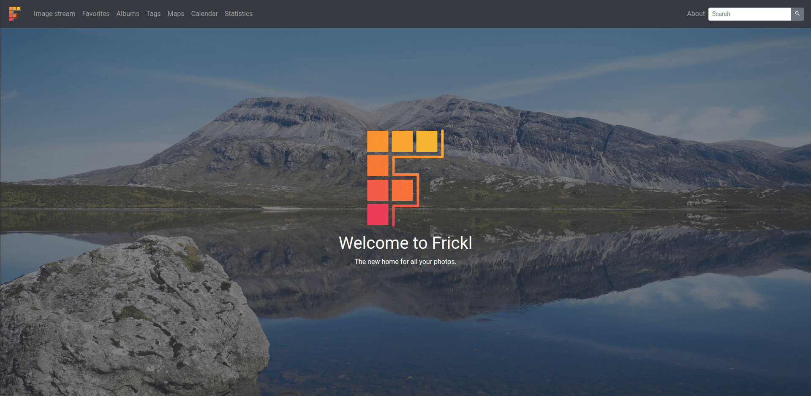
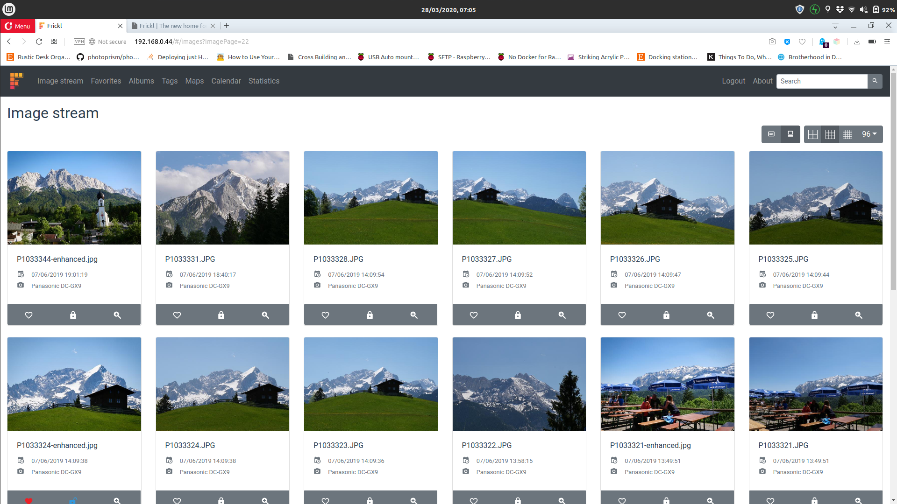
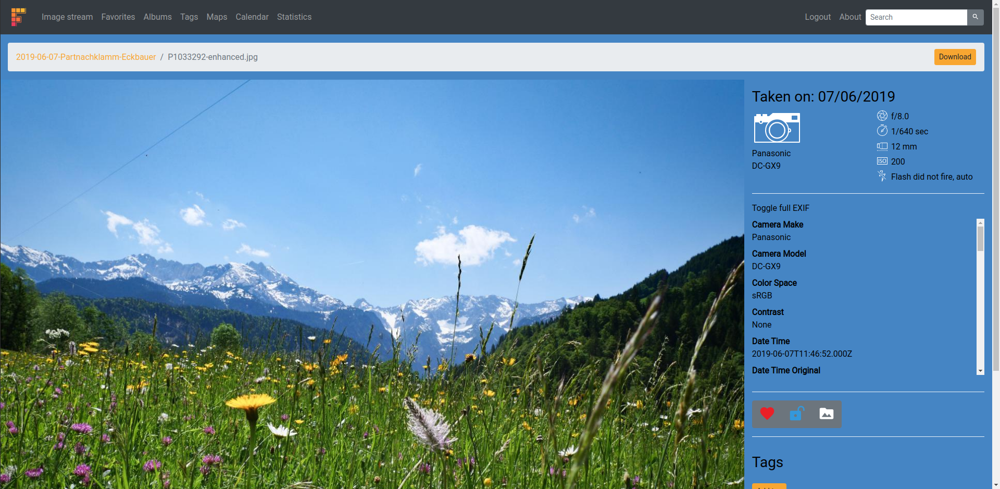
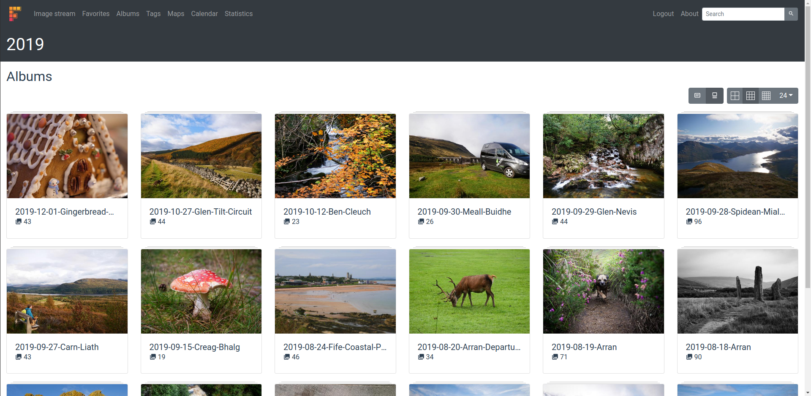
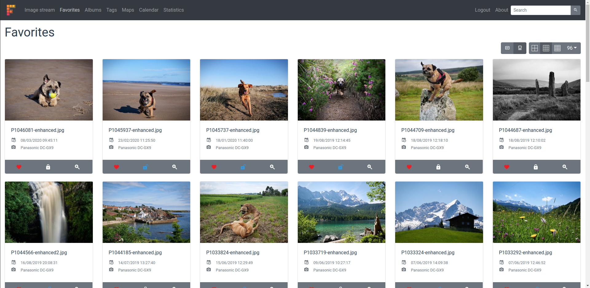
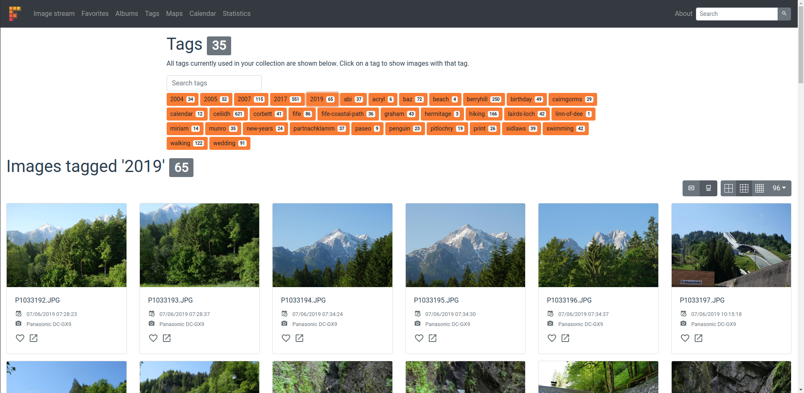
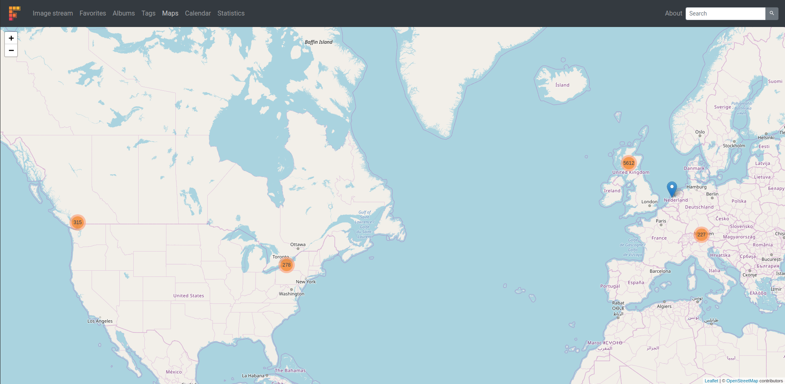
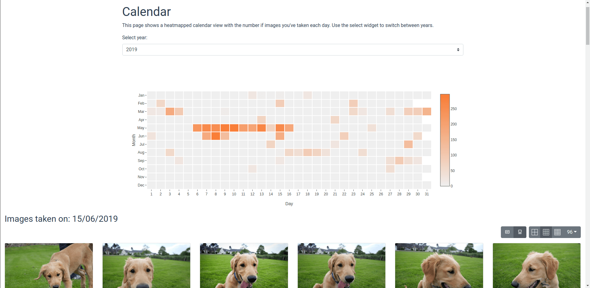
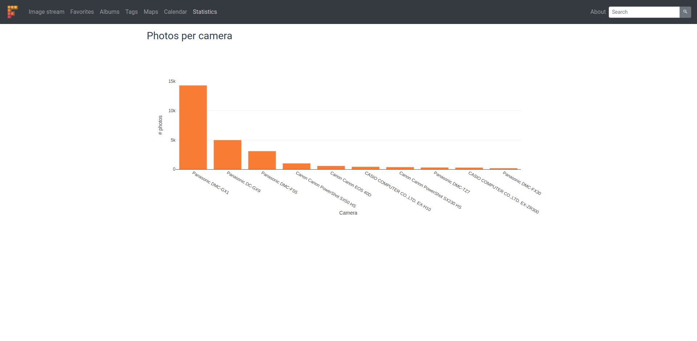
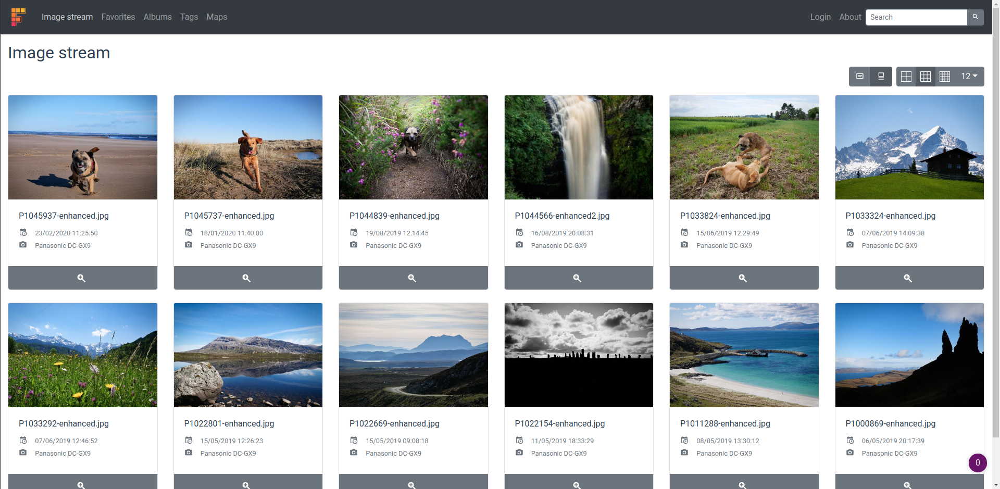

# Frickl

  
   
  <b>The new home for all your photos.</b>

## Home screen
The home screen shows a random favourite or just any random photo if no images have been marked as favourites.

## Image stream
To quickly see your latest snaps, use the image stream. All images, irrespective of album, are shown based on their date in descending order.

## Image details
The image details page shows the selected image in higher resolution and displays information about the camera, geographic location and image tags.

## Albums
The albums correspond to your folder structure in your image collection. In this example, albums/folders have been created based on the date they were taken on. Frickl will display them in that exact structure without you having to do anything.

## Favourites
Images can be marked as favourites and will be shown on a dedicated page so that they are easily accessible.

## Tags
Any number of tags can be assigned to individual images or all images within a folder. There is no automatic image tagging based on machine learning, but it's still an incredibly useful mechanism. Image tags are also stored within the images themselves, so they can be used outside of Frickl.

## Map
The map shows geotagged images around the globe to highlight all the places you've been to.

## Calendar
Want to know when you tend to take the most photos? The calendar shows you a heatmapped calendar view based on the number of images taken each day. Clicking on a day shows all photos from this day.

## Statistics
There's also a wee page with some statistics across all your photos. This page is going to be expanded on in the near future.

## Password protection
Frickl can be password protected so that only people with the user credentials can see all images. Everyone else only gets to see what you specifically marked as public.

